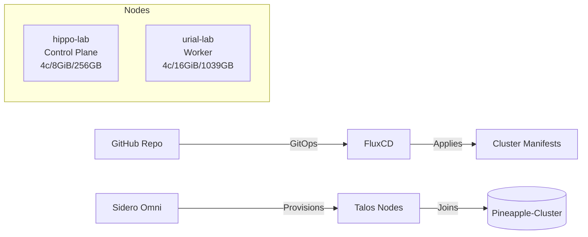

# 🍍 Pineapple-Cluster — Kubernetes Cluster (Sidero Omni + FluxCD)

> **👤 Owner:** Ahmad Haiqal Abd Halim  
> **📛 Cluster Name:** `Pineapple-Cluster`  
> **🔗 GitOps:** FluxCD + Renovate  
> **🖥 Infra Control Plane:** Sidero Omni (Talos OS)  
> **📍 Location:** Pekan Nenas Lab  
> **✅ Status:** Active

---

## 🌟 Overview

This repository is the **source of truth** for the **Pineapple-Cluster** Kubernetes cluster, managed via **GitOps** using **FluxCD** and provisioned by **Sidero Omni**. It includes cluster manifests, platform services, and application workloads.

### ✨ Key Features
- ✅ Declarative cluster configuration
- 🔄 GitOps-driven updates with FluxCD
- 🤖 Automated dependency updates via Renovate
- 🔐 Secure secrets management with SOPS + Age
- 📊 Observability stack (Prometheus + Grafana)
- 🌐 Networking powered by **Cilium**
- 🚪 Ingress via **Traefik** with **Cloudflare DNS solver**
- 💾 Persistent storage via **Longhorn**

---

## 🏗 Architecture

---

## 🖥 Machines

| 🏷 Hostname    | 🎭 Role          | ⚙️ CPU | 🧠 Memory | 💾 Storage | 🌐 Network | 🏗 Arch  |
|---------------|-----------------|-------|----------|-----------|-----------|---------|
| `hippo-lab`  | Control Plane   | 4     | 8GiB     | 256GB     | 1Gbps     | amd64   |
| `urial-lab`  | Worker          | 4     | 16GiB    | 1039GB    | 1Gbps     | amd64   |

---

## 🛠 Tech Stack

- 🌐 **Networking:** Cilium  
- 🚪 **Ingress:** Traefik  
- 🔐 **DNS & Certs:** cert-manager + Cloudflare DNS solver  
- 💾 **Storage:** Longhorn  
- 🔑 **Secrets:** SOPS with Age  
- 📊 **Observability:** Prometheus + Grafana  
- 🔄 **GitOps:** FluxCD  
- 🤖 **Update Automation:** Renovate  
- 🖥 **Node OS:** Talos (via Sidero Omni)  

---

## 📦 Helm Repositories (Pinned)

- 🐋 `cilium`
- 🐘 `cloudnativepg`
- 🌍 `external-dns`
- 🔍 `flaresolverrr`
- 🚦 `traefik`
- 🤖 `renovate`
- 📊 `kube-prometheus-stack`

---

## 📊 Observability

- ✅ Prometheus Operator via `kube-prometheus-stack`
- 📈 Dashboards in Grafana
- 🔔 Alerting via Alertmanager

---

## ⚙️ CI/CD

- 🔄 FluxCD for reconciliation
- 🤖 Renovate for dependency updates

---

## 📜 License

`Apache-2.0`
