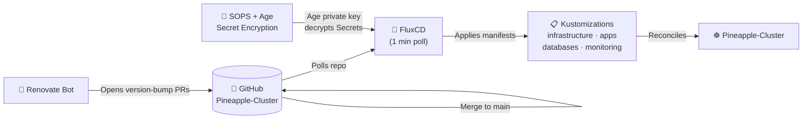
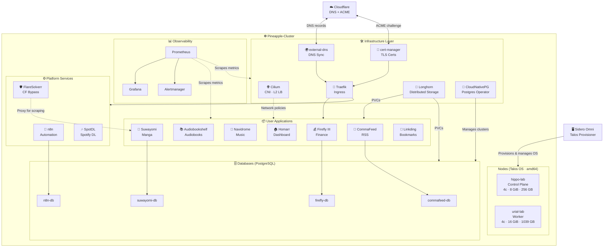

# 🍍 Pineapple-Cluster — Kubernetes Cluster (Sidero Omni + FluxCD)

> **👤 Owner:** Ahmad Haiqal Abd Halim  
> **📛 Cluster Name:** `Pineapple-Cluster`  
> **🔗 GitOps:** FluxCD + Renovate  
> **🖥 Infra Control Plane:** Sidero Omni (Talos OS)  
> **📍 Location:** Pekan Nenas Lab  
> **✅ Status:** Active

---

## 🌟 Overview

This repository is the **source of truth** for the **Pineapple-Cluster** Kubernetes cluster, managed via **GitOps** using **FluxCD** and provisioned by **Sidero Omni**. It includes cluster manifests, platform services, and application workloads.

### ✨ Key Features
- ✅ Declarative cluster configuration
- 🔄 GitOps-driven updates with FluxCD
- 🤖 Automated dependency updates via Renovate
- 🔐 Secure secrets management with SOPS + Age
- 📊 Observability stack (Prometheus + Grafana)
- 🌐 Networking powered by **Cilium**
- 🚪 Ingress via **Traefik** with **Cloudflare DNS solver**
- 💾 Persistent storage via **Longhorn**

---

## 🔄 GitOps Pipeline

```mermaid
flowchart LR
    REN["🤖 Renovate Bot"]
    GH[("🐙 GitHub\nPineapple-Cluster")]
    SOPS["🔐 SOPS + Age\nSecret Encryption"]
    FLUX["🔄 FluxCD\n(1 min poll)"]
    KUST["📋 Kustomizations\ninfrastructure · apps\ndatabases · monitoring"]
    CLUSTER["☸️ Pineapple-Cluster"]

    REN -- "Opens version-bump PRs" --> GH
    GH -- "Merge to main" --> GH
    GH -- "Polls repo" --> FLUX
    SOPS -- "Age private key\ndecrypts Secrets" --> FLUX
    FLUX -- "Applies manifests" --> KUST
    KUST -- "Reconciles" --> CLUSTER
```

---

## 🏗 Cluster Architecture

```mermaid
flowchart TB
    %% External
    OMNI["🖥 Sidero Omni\nTalos Provisioner"]
    CF["☁️ Cloudflare\nDNS + ACME"]

    %% Cluster boundary
    subgraph CLUSTER["☸️ Pineapple-Cluster"]

        subgraph NODES["Nodes (Talos OS · amd64)"]
            direction LR
            HIPPO["hippo-lab\nControl Plane\n4c · 8 GiB · 256 GB"]
            URIAL["urial-lab\nWorker\n4c · 16 GiB · 1039 GB"]
        end

        subgraph INFRA["🛠 Infrastructure Layer"]
            direction TB
            CILIUM["🌐 Cilium\nCNI · L2 LB"]
            TRAEFIK["🚪 Traefik\nIngress"]
            CERTMGR["🔏 cert-manager\nTLS Certs"]
            EXTDNS["🌍 external-dns\nDNS Sync"]
            LONGHORN["💾 Longhorn\nDistributed Storage"]
            CNPG["🐘 CloudNativePG\nPostgres Operator"]
        end

        subgraph OBS["📊 Observability"]
            direction LR
            PROM["Prometheus"]
            GRAFANA["Grafana"]
            ALERT["Alertmanager"]
        end

        subgraph DB["🗄 Databases (PostgreSQL)"]
            direction LR
            PG1["commafeed-db"]
            PG2["firefly-db"]
            PG3["n8n-db"]
            PG4["suwayomi-db"]
        end

        subgraph PLATFORM["⚙️ Platform Services"]
            direction LR
            N8N["🔧 n8n\nAutomation"]
            FLARE["🛡 FlareSolverr\nCF Bypass"]
            SPOTDL["🎶 SpotDL\nSpotify DL"]
        end

        subgraph APPS["📦 User Applications"]
            direction LR
            HOMARR["🏠 Homarr\nDashboard"]
            AUDIO["📚 Audiobookshelf\nAudiobooks"]
            NAVI["🎵 Navidrome\nMusic"]
            SUWA["📖 Suwayomi\nManga"]
            FIREFLY["💰 Firefly III\nFinance"]
            COMMA["📰 CommаFeed\nRSS"]
            LINK["🔖 Linkding\nBookmarks"]
        end
    end

    %% External connections
    OMNI -- "Provisions & manages OS" --> NODES
    CF <-- "DNS records" --> EXTDNS
    CF <-- "ACME challenge" --> CERTMGR

    %% Infrastructure wiring
    CERTMGR --> TRAEFIK
    EXTDNS --> TRAEFIK
    CILIUM -. "Network policies" .-> APPS
    LONGHORN -- "PVCs" --> APPS
    LONGHORN -- "PVCs" --> DB
    CNPG -- "Manages clusters" --> DB

    %% Ingress routing
    TRAEFIK --> APPS
    TRAEFIK --> PLATFORM

    %% Observability
    PROM --> GRAFANA
    PROM --> ALERT
    PROM -. "Scrapes metrics" .-> APPS
    PROM -. "Scrapes metrics" .-> INFRA

    %% App → DB
    COMMA --> PG1
    FIREFLY --> PG2
    N8N --> PG3
    SUWA --> PG4

    %% Inter-service
    FLARE -. "Proxy for scraping" .-> SUWA
```

---

## 🖥 Machines

| 🏷 Hostname    | 🎭 Role          | ⚙️ CPU | 🧠 Memory | 💾 Storage | 🌐 Network | 🏗 Arch  |
|---------------|-----------------|-------|----------|-----------|-----------|---------|
| `hippo-lab`  | Control Plane   | 4     | 8 GiB    | 256 GB    | 1 Gbps    | amd64   |
| `urial-lab`  | Worker          | 4     | 16 GiB   | 1039 GB   | 1 Gbps    | amd64   |

---

## 🛠 Tech Stack

| Layer | Technology |
|---|---|
| 🌐 Networking | Cilium (CNI + L2 LoadBalancer) |
| 🚪 Ingress | Traefik |
| 🔐 DNS & Certs | cert-manager + Cloudflare DNS solver |
| 💾 Storage | Longhorn |
| 🔑 Secrets | SOPS with Age |
| 📊 Observability | Prometheus + Grafana + Alertmanager |
| 🗄 Database | CloudNativePG (PostgreSQL) |
| 🔄 GitOps | FluxCD |
| 🤖 Update Automation | Renovate |
| 🖥 Node OS | Talos (via Sidero Omni) |

---

## 📦 Applications

| App | Description | Database |
|---|---|---|
| [Homarr](https://homarr.dev) | Homepage dashboard | — |
| [Audiobookshelf](https://www.audiobookshelf.org) | Self-hosted audiobook server | — |
| [Navidrome](https://www.navidrome.org) | Music streaming server | — |
| [Suwayomi](https://github.com/Suwayomi/Suwayomi-Server) | Manga reader | PostgreSQL |
| [Firefly III](https://www.firefly-iii.org) | Personal finance manager | PostgreSQL |
| [CommаFeed](https://www.commafeed.com) | RSS/Atom feed reader | PostgreSQL |
| [Linkding](https://github.com/sissbruecker/linkding) | Bookmark manager | — |

## ⚙️ Platform Services

| Service | Description |
|---|---|
| [n8n](https://n8n.io) | Workflow automation engine |
| [FlareSolverr](https://github.com/FlareSolverr/FlareSolverr) | Cloudflare bypass proxy for scrapers |
| [SpotDL](https://spotdl.readthedocs.io) | Spotify music downloader |

---

## 📊 Observability

- Prometheus Operator via `kube-prometheus-stack`
- Dashboards in Grafana
- Alerting via Alertmanager

---

## 📜 License

`Apache-2.0`
