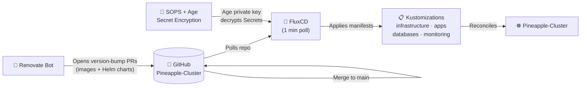

# 🍍 Pineapple-Cluster — Kubernetes Cluster (Sidero Omni + FluxCD)

> **👤 Owner:** Ahmad Haiqal Abd Halim  
> **📛 Cluster Name:** `Pineapple-Cluster`  
> **🔗 GitOps:** FluxCD + Renovate  
> **🖥 Infra Control Plane:** Sidero Omni (Talos OS)  
> **📍 Location:** Pekan Nenas Lab  
> **✅ Status:** Active

---

## 🌟 Overview

This repository is the **source of truth** for the **Pineapple-Cluster** Kubernetes cluster, managed via **GitOps** using **FluxCD** and provisioned by **Sidero Omni**. It includes cluster manifests, platform services, and application workloads.

### ✨ Key Features
- ✅ Declarative cluster configuration
- 🔄 GitOps-driven updates with FluxCD
- 🤖 Automated dependency updates via Renovate (container images + Helm charts)
- 🔐 Secure secrets management with SOPS + Age
- 📊 Observability stack (Prometheus + Grafana)
- 🌐 Networking powered by **Cilium**
- 🚪 Ingress via **Traefik** with **Cloudflare tunnels**
- 💾 Persistent storage via **Longhorn**
- 📌 All container images pinned to explicit version tags

---

## 🔄 GitOps Pipeline

```mermaid
flowchart LR
    REN["🤖 Renovate Bot"]
    GH[("🐙 GitHub\nPineapple-Cluster")]
    SOPS["🔐 SOPS + Age\nSecret Encryption"]
    FLUX["🔄 FluxCD\n(1 min poll)"]
    KUST["📋 Kustomizations\ninfrastructure · apps\ndatabases · monitoring"]
    CLUSTER["☸️ Pineapple-Cluster"]

    REN -- "Opens version-bump PRs\n(images + Helm charts)" --> GH
    GH -- "Merge to main" --> GH
    GH -- "Polls repo" --> FLUX
    SOPS -- "Age private key\ndecrypts Secrets" --> FLUX
    FLUX -- "Applies manifests" --> KUST
    KUST -- "Reconciles" --> CLUSTER
```

---

## 🏗 Cluster Architecture

```mermaid
flowchart TB
    %% External
    OMNI["🖥 Sidero Omni\nTalos Provisioner"]
    CF["☁️ Cloudflare\nDNS + Tunnels"]

    %% Cluster boundary
    subgraph CLUSTER["☸️ Pineapple-Cluster"]

        subgraph NODES["Nodes (Talos OS · amd64)"]
            direction LR
            HIPPO["hippo-lab\nControl Plane\n4c · 8 GiB · 256 GB"]
            URIAL["urial-lab\nWorker\n4c · 16 GiB · 1039 GB"]
        end

        subgraph INFRA["🛠 Infrastructure Layer"]
            direction TB
            CILIUM["🌐 Cilium\nCNI · L2 LB"]
            TRAEFIK["🚪 Traefik\nIngress"]
            EXTDNS["🌍 external-dns\nDNS Sync"]
            LONGHORN["💾 Longhorn\nDistributed Storage"]
            CNPG["🐘 CloudNativePG\nPostgres Operator"]
        end

        subgraph OBS["📊 Observability"]
            direction LR
            PROM["Prometheus"]
            GRAFANA["Grafana"]
            ALERT["Alertmanager"]
        end

        subgraph DB["🗄 Databases (PostgreSQL)"]
            direction LR
            PG1["firefly-db"]
            PG2["n8n-db"]
            PG3["immich-db"]
            PG4["sparkyfitness-db"]
        end

        subgraph PLATFORM["⚙️ Platform Services"]
            direction LR
            N8N["🔧 n8n\nAutomation"]
            FLARE["🛡 FlareSolverr\nCF Bypass"]
        end

        subgraph MEDIA["🎬 Media Stack (urial-lab)"]
            direction LR
            JELLY["🎞 Jellyfin\nMedia Server"]
            SONARR["📺 Sonarr\nTV Manager"]
            RADARR["🎬 Radarr\nMovie Manager"]
            PROWLARR["🔍 Prowlarr\nIndexer"]
            RDT["☁️ rdt-client\nReal-Debrid"]
            SEERR["🔎 Seerr\nRequest Manager"]
            SPOTDL["🎶 SpotDL\nSpotify Sync"]
        end

        subgraph APPS["📦 User Applications"]
            direction LR
            HOMARR["🏠 Homarr\nDashboard"]
            AUDIO["📚 Audiobookshelf\nAudiobooks"]
            NAVI["🎵 Navidrome\nMusic"]
            SUWA["📖 Suwayomi\nManga"]
            FIREFLY["💰 Firefly III\nFinance"]
            LINK["🔖 Linkding\nBookmarks"]
            IMMICH["📷 Immich\nPhoto Gallery"]
            SPARKY["🏋️ SparkyFitness\nFitness Tracker"]
        end
    end

    %% External connections
    OMNI -- "Provisions & manages OS" --> NODES
    CF <-- "DNS records" --> EXTDNS
    CF <-- "Tunnels traffic" --> TRAEFIK

    %% Infrastructure wiring
    CILIUM -. "Network policies" .-> APPS
    CILIUM -. "Network policies" .-> MEDIA
    LONGHORN -- "PVCs" --> APPS
    LONGHORN -- "PVCs" --> MEDIA
    LONGHORN -- "PVCs" --> DB
    CNPG -- "Manages clusters" --> DB

    %% Ingress routing
    TRAEFIK --> APPS
    TRAEFIK --> MEDIA
    TRAEFIK --> PLATFORM

    %% Observability
    PROM --> GRAFANA
    PROM --> ALERT
    PROM -. "Scrapes metrics" .-> APPS
    PROM -. "Scrapes metrics" .-> INFRA

    %% App → DB
    FIREFLY --> PG1
    N8N --> PG2
    IMMICH --> PG3
    SPARKY --> PG4

    %% Media stack wiring
    SEERR -. "Requests" .-> SONARR
    SEERR -. "Requests" .-> RADARR
    SONARR -. "Sends to" .-> RDT
    RADARR -. "Sends to" .-> RDT
    PROWLARR -. "Indexers" .-> SONARR
    PROWLARR -. "Indexers" .-> RADARR
    RDT -. "Downloads" .-> JELLY
    SPOTDL -. "Playlists + .m3u8" .-> NAVI

    %% Inter-service
    FLARE -. "Proxy for scraping" .-> SUWA
```

---

## 🖥 Machines

| 🏷 Hostname    | 🎭 Role          | ⚙️ CPU | 🧠 Memory | 💾 Storage | 🌐 Network | 🏗 Arch  |
|---------------|-----------------|-------|----------|-----------|-----------|---------|
| `hippo-lab`  | Control Plane   | 4     | 8 GiB    | 256 GB    | 1 Gbps    | amd64   |
| `urial-lab`  | Worker          | 4     | 16 GiB   | 1039 GB   | 1 Gbps    | amd64   |

---

## 🛠 Tech Stack

| Layer | Technology |
|---|---|
| 🌐 Networking | Cilium (CNI + L2 LoadBalancer) |
| 🚪 Ingress | Traefik + Cloudflare Tunnels |
| 🌍 DNS | external-dns + Cloudflare |
| 💾 Storage | Longhorn |
| 🔑 Secrets | SOPS with Age |
| 📊 Observability | Prometheus + Grafana + Alertmanager |
| 🗄 Database | CloudNativePG (PostgreSQL) |
| 🔄 GitOps | FluxCD |
| 🤖 Update Automation | Renovate (images + Helm charts) |
| 🖥 Node OS | Talos (via Sidero Omni) |

---

## 📦 Applications

| App | Description | Database |
|---|---|---|
| [Homarr](https://homarr.dev) | Homepage dashboard | — |
| [Audiobookshelf](https://www.audiobookshelf.org) | Self-hosted audiobook server | — |
| [Suwayomi](https://github.com/Suwayomi/Suwayomi-Server) | Manga reader | — |
| [Firefly III](https://www.firefly-iii.org) | Personal finance manager | PostgreSQL |
| [Linkding](https://github.com/sissbruecker/linkding) | Bookmark manager | — |
| [Immich](https://immich.app) | Self-hosted photo & video gallery | PostgreSQL |
| [SparkyFitness](https://github.com/CodeWithCJ/SparkyFitness) | Fitness & nutrition tracker | PostgreSQL |

## 🎬 Media Stack

| App | Description | Database |
|---|---|---|
| [Jellyfin](https://jellyfin.org) | Media server | — |
| [Sonarr](https://sonarr.tv) | TV series manager | — |
| [Radarr](https://radarr.video) | Movie manager | — |
| [Prowlarr](https://github.com/Prowlarr/Prowlarr) | Indexer manager for Sonarr/Radarr | — |
| [rdt-client](https://github.com/rogerfar/rdt-client) | Real-Debrid download client (Sonarr/Radarr) | — |
| [Seerr](https://github.com/seerr/seerr) | Media request & discovery manager | — |
| [Navidrome](https://www.navidrome.org) | Music streaming server | — |
| [SpotDL](https://spotdl.readthedocs.io) | Spotify playlist mirror (CronJob; syncs adds/removals and exports .m3u8 playlists Navidrome auto-imports) | — |

## ⚙️ Platform Services

| Service | Description |
|---|---|
| [n8n](https://n8n.io) | Workflow automation engine |
| [FlareSolverr](https://github.com/FlareSolverr/FlareSolverr) | Cloudflare bypass proxy for scrapers |

## 💤 Currently Disabled

These workloads exist in the repo but are commented out of their Kustomization (not reconciled to the cluster):

| App | Reason |
|---|---|
| [CommaFeed](https://github.com/Athou/commafeed) | Inactive (RSS reader) |

---

## 📊 Observability

- Prometheus Operator via `kube-prometheus-stack`
- Dashboards in Grafana
- Alerting via Alertmanager

---

## 🧰 Scripts

| Script | Purpose |
|---|---|
| `scripts/homarr-seed.py` | Seeds the Homarr dashboard (apps, layout) via its REST API — Homarr boards live in its database, not in Git, so this script makes the dashboard reproducible. Run it against a port-forward, not the Cloudflare tunnel. |

---

## 📜 License

`Apache-2.0`
